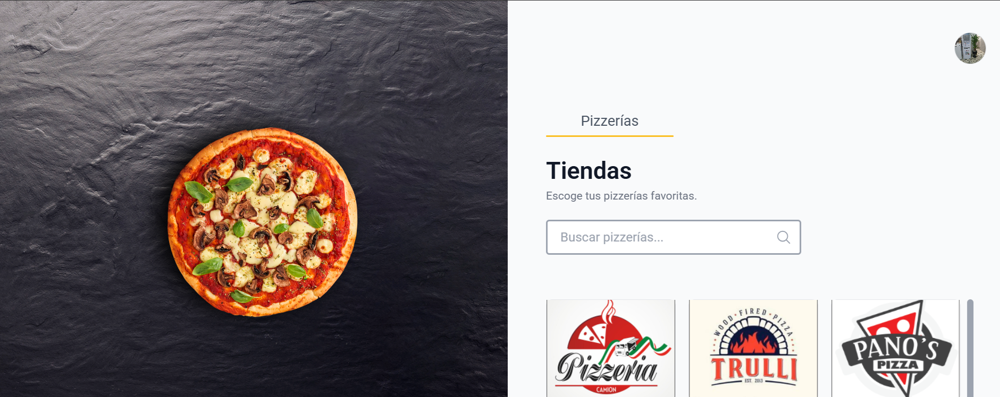
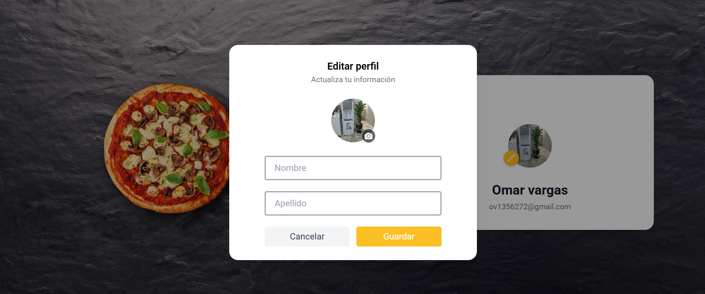
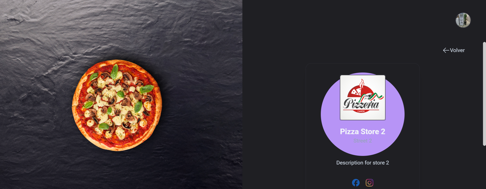
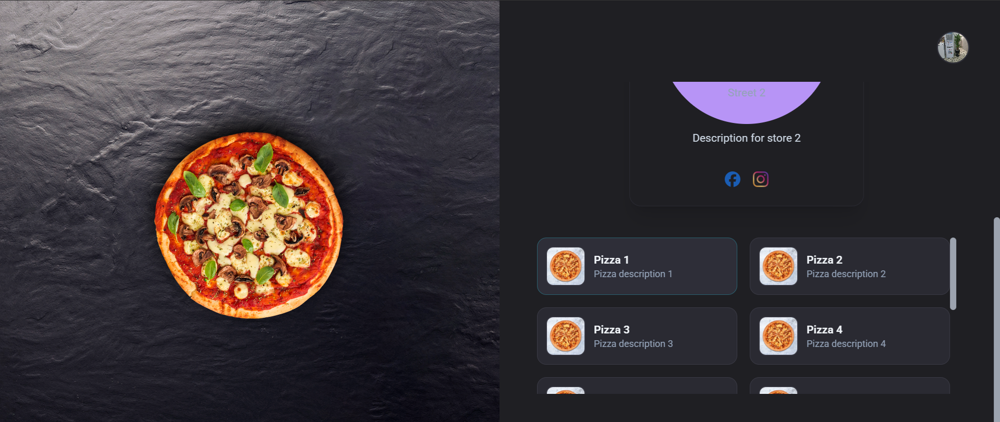

# Nombre del proyecto

PizzaHub

---

## Descripción

Frontend de una plataforma de gestión de pizzerías desarrollado como una referencia de arquitectura moderna en React. El proyecto prioriza la escalabilidad, la mantenibilidad y la separación de responsabilidades mediante una arquitectura MVC, Atomic Design y una infraestructura reutilizable para el manejo de estado del servidor, autenticación e internacionalización.

---

## Capturas

### Login


### Home



### Configuración


### Configuración theme oscuro


### Perfil


### Editar perfil



### Editar perfil


### Detalle pizza 1



### Detalle pizza 2



---

## Tecnologías

| Tecnología | Propósito |
|------------|-----------|
| React 19 | Construcción de la interfaz de usuario mediante componentes reutilizables. |
| TypeScript | Tipado estático para mejorar la mantenibilidad y prevenir errores en tiempo de desarrollo. |
| TanStack Router | Enrutamiento tipado y manejo de rutas públicas y privadas. |
| TanStack Query | Gestión del estado del servidor, caché, sincronización y consultas asíncronas. |
| React Hook Form | Manejo eficiente de formularios con mínimo número de renderizados. |
| Zod | Validación y tipado de formularios y contratos de entrada. |
| Zustand | Gestión del estado global de la interfaz (loading, snackbars, modal, etc.). |
| Tailwind CSS | Construcción de interfaces mediante clases utilitarias. |
| Heroicons | Biblioteca de iconos SVG utilizada en la interfaz. |
| webpack | Herramienta de desarrollo y construcción del proyecto. |

---

## Principales decisiones técnicas

- Arquitectura MVC adaptada a React para separar responsabilidades entre Model, Controller y View.
- Organización Feature-Based para aislar cada módulo de negocio.
- Atomic Design para la construcción de componentes reutilizables.
- React Query como única fuente de verdad para el estado del servidor.
- Internacionalización desacoplada mediante recursos propios por feature y recursos compartidos.
- Manejo reutilizable de estados de carga y error mediante `QueryBoundary`.
- Componentes compartidos para representar estados vacíos (`EmptyState`) y carga (`Skeleton`).

---

## Arquitectura

La aplicación fue diseñada con el objetivo de mantener una separación clara de responsabilidades, facilitar la escalabilidad de nuevas funcionalidades y promover la reutilización de infraestructura y componentes compartidos.

```text
┌─────────────────────────────┐
│            View             │
└─────────────┬───────────────┘
              │
              ▼
┌─────────────────────────────┐
│         Controller          │
└─────────────┬───────────────┘
              │
              ▼
┌─────────────────────────────┐
│           Model             │
└─────────────┬───────────────┘
              │
              ▼
┌─────────────────────────────┐
│        Backend API          │
└─────────────────────────────┘
```

La aplicación implementa una arquitectura MVC, donde cada capa tiene una responsabilidad claramente definida. El flujo de datos es unidireccional: la vista interactúa con el controlador, el controlador orquesta la lógica de negocio utilizando el modelo y el modelo se encarga de la comunicación con la API.

* View:
    - Responsable de renderizar la interfaz de usuario.
    - Consume únicamente el contrato expuesto por el Controller.
    - No contiene lógica de negocio ni acceso directo a la API.
    - Está construida siguiendo Atomic Design para favorecer la reutilización de componentes.

* Controller:
    - Orquesta la lógica de cada pantalla.
    - Consume el Model para obtener y modificar información.
    - Gestiona el estado derivado necesario para la interfaz.
    - Expone un contrato simple y desacoplado para la View.
    - Mantiene la lógica de presentación fuera de los componentes visuales.

* Model:
    - Encapsula la comunicación con el backend.
    - Define contratos tipados para solicitudes y respuestas.
    - Centraliza servicios HTTP y consultas mediante React Query.
    - Contiene validaciones y transformaciones de datos cuando son necesarias.
    - Mantiene desacoplada la infraestructura del resto de la aplicación.

### Organización por Features

La aplicación está organizada siguiendo una estructura Feature-Based, donde cada módulo de negocio encapsula sus propias responsabilidades. Esto permite desarrollar nuevas funcionalidades de manera aislada, reducir el acoplamiento entre módulos y facilitar el mantenimiento del proyecto a medida que crece.
```text
features/
|
├── Login/
│   ├── controller/
│   ├── i18n/
│   ├── model/
│   ├── view/
│   └── index.ts
│
├── Home/
│   ├── controller/
│   ├── i18n/
│   ├── model/
│   ├── view/
│   └── index.ts
│
└── Profile/
    ├── controller/
    ├── i18n/
    ├── model/
    ├── view/
    └── index.ts
```

Cada feature agrupa todos los elementos necesarios para implementar una funcionalidad:
- View: componentes visuales.
- Controller: lógica de presentación.
- Model: contratos, servicios, validaciones y consultas.
- i18n: recursos de internacionalización propios de la feature.

### Recursos compartidos (shared)

La carpeta shared concentra la infraestructura y los recursos reutilizables de la aplicación. Su objetivo es evitar duplicación de código y proporcionar una única fuente de verdad para funcionalidades transversales utilizadas por múltiples features.

```text
shared/
|
├── api/
├── components/
├── hooks/
├── i18n/
├── stores/
├── types/
└── utils/
```

| Carpeta      | Responsabilidad                                                               |
| ------------ | ----------------------------------------------------------------------------- |
| `api`        | Cliente HTTP y configuración para la comunicación con el backend.             |
| `components` | Componentes reutilizables compartidos entre múltiples features.               |
| `hooks`      | Hooks reutilizables independientes de una funcionalidad específica.           |
| `i18n`       | Recursos de internacionalización globales compartidos por toda la aplicación. |
| `stores`     | Estado global de la aplicación mediante Zustand.                              |
| `types`      | Tipos compartidos entre diferentes módulos.                                   |
| `utils`      | Funciones auxiliares reutilizables.                                           |

Un recurso solo pertenece a shared cuando es reutilizable por dos o más features. Si su uso está limitado a una única funcionalidad, debe permanecer dentro de la feature correspondiente para mantener el bajo acoplamiento y favorecer el encapsulamiento.

### Atomic Design

La capa View se organiza siguiendo Atomic Design, permitiendo construir interfaces reutilizables y mantener una jerarquía consistente entre los componentes. Cada nivel posee una responsabilidad específica dentro de la composición de la interfaz.

| Nivel         | Responsabilidad                                                                                                                                                               |
| ------------- | ----------------------------------------------------------------------------------------------------------------------------------------------------------------------------- |
| **Atoms**     | Componentes básicos e independientes, reutilizables en toda la aplicación.                                                                                                    |
| **Molecules** | Composición de uno o varios Atoms para resolver una única responsabilidad de interfaz.                                                                                        |
| **Organisms** | Componentes de mayor complejidad que representan una unidad funcional de la interfaz y que pueden encapsular su propio flujo MVC cuando la funcionalidad lo requiere.         |
| **Templates** | Composiciones visuales reutilizables utilizadas como estructura o representación de estados específicos de la interfaz, sin lógica de negocio ni flujo propio.                |
| **Pages**     | Punto de entrada de cada feature. Son las únicas vistas expuestas al sistema de rutas y ensamblan la pantalla utilizando Organisms, Templates y otros componentes necesarios. |

#### Convenciones del proyecto

- Cada feature expone una única Page mediante su archivo index.ts.
- Las Pages son el único punto de integración con el sistema de rutas.
- Los Organisms pueden encapsular comportamiento propio cuando la complejidad de la funcionalidad lo requiere.
- Los Templates representan únicamente composición visual y nunca contienen lógica de negocio.
- La lógica de presentación permanece desacoplada de la View mediante la arquitectura MVC.

### Principios de diseño

#### Estado del servidor

Toda la comunicación con el backend se centraliza mediante React Query. La View nunca realiza llamadas HTTP directamente, únicamente consume el estado expuesto por el Controller. Esto permite aprovechar caché, sincronización automática y una gestión consistente del estado del servidor.

#### Separación de responsabilidades

La lógica de presentación se mantiene fuera de los componentes visuales mediante la arquitectura MVC. La View se limita a representar información, mientras que el Controller orquesta el comportamiento de la pantalla y el Model encapsula el acceso a datos.

#### Manejo uniforme de estados

Los estados de carga, error y ausencia de información se representan mediante componentes reutilizables (QueryBoundary, Skeleton y EmptyState), evitando duplicación de lógica y proporcionando una experiencia de usuario consistente en toda la aplicación.

#### Internacionalización

Cada feature administra sus propios recursos de traducción, mientras que los textos compartidos permanecen centralizados en shared. Esta organización facilita el crecimiento del proyecto y la incorporación de nuevos idiomas sin aumentar el acoplamiento entre módulos.

#### Componentes reutilizables

Los componentes compartidos se incorporan únicamente cuando existe una necesidad real de reutilización entre múltiples features. Las implementaciones específicas permanecen encapsuladas dentro de cada módulo para preservar el bajo acoplamiento.

#### Actualización de datos

Las mutaciones actualizan el estado local mediante la caché de React Query cuando es posible, evitando solicitudes adicionales al servidor y mejorando la percepción de rendimiento de la aplicación.

---

## Estructura del proyecto

```text
src/
│
├── assets/
├── config/
├── features/
├── router/
├── shared/
├── App.tsx
└── index.tsx
```

| Directorio  | Responsabilidad                                                    |
| ----------- | ------------------------------------------------------------------ |
| `assets`    | Recursos estáticos de la aplicación, como imágenes e íconos.       |
| `config`    | Centraliza la configuración técnica de la aplicación e inicializa servicios independientes del dominio, como variables de entorno o integraciones externas.     |
| `features`  | Módulos funcionales organizados mediante Feature-Based.            |
| `router`    | Configuración del sistema de rutas de la aplicación.               |
| `shared`    | Contiene la infraestructura reutilizable propia de la aplicación, compartida entre múltiples features, como autenticación, cliente HTTP, internacionalización, componentes y estado global. |
| `App.tsx`   | Composición principal de la aplicación.                            |
| `index.tsx` | Punto de entrada de React.                                         |


---

## Funcionalidades

### Autenticación
- Inicio de sesión.
- Recuperación de contraseña.
- Persistencia de sesión.
- Protección de rutas privadas.

### Perfil
- Consulta de información del usuario.
- Actualización de datos personales.
- Cambio de avatar.
- Actualización optimista del estado mediante React Query.

### Consulta de pizzerías.
- Búsqueda local por nombre.
- Consulta de detalle de una pizzería.
- Visualización de pizzas disponibles.

### Experiencia de usuario
- Tema claro y oscuro.
- Skeletons durante la carga.
- Estados vacíos mediante EmptyState.
- Manejo uniforme de errores mediante QueryBoundary.
- Notificaciones mediante Snackbar.

### Internacionalización
- Recursos compartidos.
- Recursos específicos por feature.
- Mensajes desacoplados del código.

---

## Instalación

### 1. Clonar el repositorio

```bash
git clone <url-del-repositorio>
cd <nombre-del-proyecto>
```

### 2. Instalar dependencias

```bash
npm install
```

### 3. Configurar las variables de entorno

Crear un archivo .env en la raíz del proyecto.
```bash
PUBLIC_API_BASE_URL=http://localhost:5000
```
### 4. Ejecutar la aplicación

```bash
npm run dev
```
### 5. Instalar dependencias

La aplicación estará disponible en: **http://localhost:3000**

---

## Variables de entorno

| Variable            | Descripción        | Requerida |
|---------------------|--------------------|-----------|
| PUBLIC_API_BASE_URL | URL base de la API | true      |

Todas las variables de entorno se validan durante la inicialización de la aplicación mediante src/config/env.ts. Si alguna variable requerida no está definida, la aplicación finalizará con un error descriptivo para evitar configuraciones inválidas.

---

## Scripts

| Comando | Descripción |
|---------|-------------|
| `npm start` | Inicia la aplicación en modo desarrollo mediante Webpack Dev Server. |
| `npm run build` | Genera la versión de producción optimizada. |
| `npm run lint` | Ejecuta ESLint sobre todo el proyecto. |
| `npm run lint:fix` | Corrige automáticamente los problemas detectados por ESLint cuando es posible. |
| `npm run format` | Formatea el código utilizando Prettier. |
| `npm run test:ci` | Ejecuta la suite de pruebas en modo no interactivo, pensado para integración continua. |

El proyecto utiliza Husky y lint-staged para ejecutar validaciones automáticas sobre los archivos modificados antes de cada commit, garantizando un formato y calidad de código consistentes.